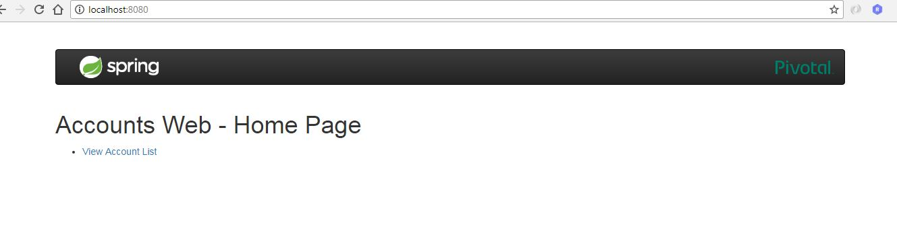
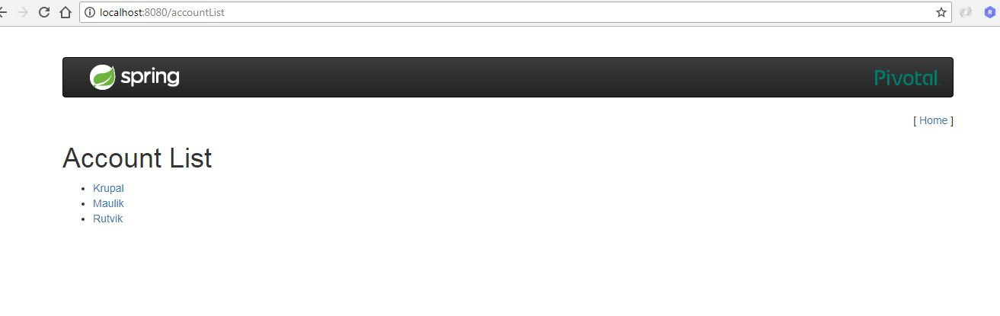
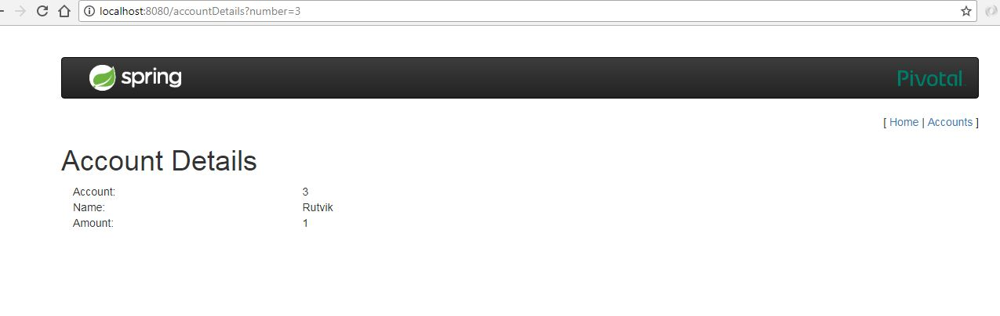

# webclient-microservice-server
> Day 3 - Spring Boot - Web Client Micro Service (main view for user)

### Description
These project is the front view of the application. From which we can access data of accounts-microservice-server.


## Screenshot
#### 1. Home Page View


#### 2.Account List View


#### 3.Account View



## To Create JAR

```sh
mvn clean package
```


## To Run JAR

```sh
java -jar target/com.rutvikpatel.ms.webclient-microservice-server-0.0.1-SNAPSHOT.jar
```


## Meta

Rutvik Patel - rrpatel003@gmail.com

Distributed under the GPL V3.0 license. See ``LICENSE`` for more information.
